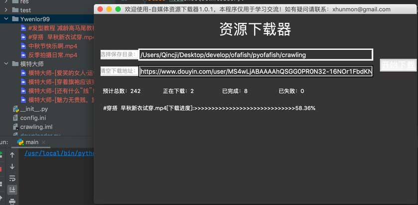

# 资源下载器
本项目主要通过网络上开源的项目聚合成了一个跨平台的下载工具，可批量下载抖音、快手和YouTube视音频资源。下载地址：
MacOS：[Downloader1.0.1-mac](https://github.com/xhunmon/PythonIsTools/releases/download/v1.0.1/downloader1.0.1-mac)

Window：[downloader1.0.1-window.exe](https://github.com/xhunmon/PythonIsTools/releases/download/v1.0.1/downloader1.0.1-window.exe)

效果如图：



#主要知识点

## python GUI(界面)

本文使用tkinter GUI(界面)框架进行界面显示：[./ui.py](ui.py) ，[学习参考](https://www.cnblogs.com/shwee/p/9427975.html) 。

## [pyinstaller](https://pyinstaller.readthedocs.io/en/stable/) 打包

使用pyinstaller把python程序打包成window和mac可执行文件，主要命令如下：
```shell
#① ：生成xxx.spec文件；（去掉命令窗口-w）
pyinstaller -F -i res/logo.ico main.py  -w
#②：修改xxx.spec，参考main.spec
#③：再次进行打包，参考installer-mac.sh
pyinstaller -F -i res/logo.ico main.spec  -w
```
注意：
pyinstaller打包工具的版本与python版本、python所需第三方库以及操作系统会存在各种问题，所以需要看日志查找问题。例如：打包后运用，发现导入pyppeteer报错，通过降低版本后能正常使用：pip install pyppeteer==0.2.2

## 项目
项目代码结构非常简单，看ui.py和downloader.py就能知道大概。支持多线程任务下载。如果自己添加其他网站的资源下载，通过增加实现downloader.py和并且在ui.py中start_download增加入口判读即可无缝接入。
