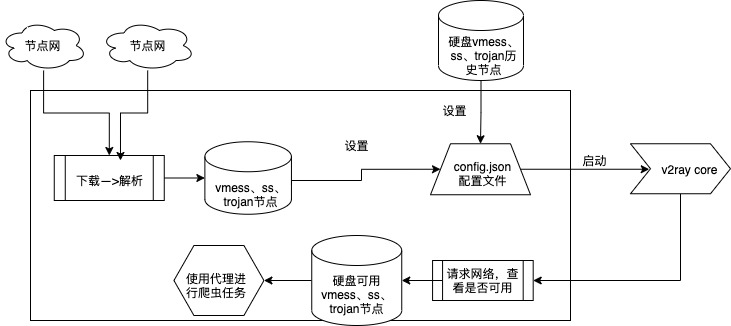

# v2ray节点代理池
学习python爬虫过程中，我们需要一些代理。而本项目则是通过收集网上公开的节点，来实现自己的代理请求的过程！

## v2ray是什么？如何使用？
- [v2ray官方指导](https://www.v2ray.com/index.html)
  
- [v2ray wiki](https://zh.wikipedia.org/wiki/V2Ray)

## v2ray客户端推荐
- [window：v2rayN](https://github.com/2dust/v2rayN/releases)
- [macOS：V2rayU](https://github.com/yanue/V2rayU/releases)
- [android：v2rayNG](https://github.com/2dust/v2rayNG/releases)
- ios推荐Shadowrocket（俗称小火箭，注意不是shadowrocket VPN），但需要付费的，可以通过找"美区apple id共享2021小火箭"，找共享的账号下载软件，但是会有风险，请一定要注意。

## v2ray服务端推荐
有些应用场景会需要到用到专用的ip代理，如Tik Tok、亚马逊和Facebook等。这是，我们通过购买国外的服务器或者vps来搭建代理服务器，从而实现专有ip代理。

推荐使用[x-ui](https://github.com/vaxilu/x-ui) 进行非常简单的"一键式"搭建开源框架。 

#本项目主要知识点
学习本项目需要先了解代理原理，以及v2ray实现的原理。

## 实现思路


## v2ray内核使用
我们找的是v2ray节点，所以这些协议只能运行在v2ray特有程序中。因此，我们要找[v2ray内核](https://github.com/v2ray/v2ray-core/releases) 。 这里就以macOS系统举例说明：
1. 下载[v2ray-core-v4.31.0](https://github.com/v2fly/v2ray-core/releases/download/v4.31.0/v2ray-macos-64.zip)
2. 配置解压目录的路径：
```python
Config.set_v2ray_core_path('xxx/Downloads/v2ray-macos-64')
```
3. 查看是否能正常启动：
```python
client.Creator().v2ray_start('ss://YWVzLTI1Ni1nY206WXlDQmVEZFlYNGNhZEhwQ2trbWRKTHE4@37.120.144.211:43893#github.com/freefq%20-%20%E7%BD%97%E9%A9%AC%E5%B0%BC%E4%BA%9A%20%2041')
```

## 2021-09-23检测可用测试节点：
```shell
#,2.59.214.204,俄罗斯莫斯科
ss://YWVzLTI1Ni1nY206OG42cHdBY3JydjJwajZ0RlkycDNUYlE2@185.153.151.85:33992#github.com/freefq%20-%20%E5%8D%A2%E6%A3%AE%E5%A0%A1%20%2051,185.153.151.86,卢森堡
trojan://ed4b6594-ea16-40f6-a935-f3985c433973@t7.ssrsub.one:8443#github.com/freefq%20-%20%E4%B9%8C%E5%85%8B%E5%85%B0%20%2052
# </p>,8.37.43.232,日本东京 Level3
vmess://eyJ2IjogIjIiLCAicHMiOiAiZ2l0aHViLmNvbS9mcmVlZnEgLSBcdTY1ZTVcdTY3MmNcdTRlMWNcdTRlYWNBbWF6b25cdTY1NzBcdTYzNmVcdTRlMmRcdTVmYzMgNTQiLCAiYWRkIjogImFmMDEudXdvcmsubW9iaSIsICJwb3J0IjogIjgwIiwgImlkIjogIjAwMDAwMDAwLTAwMDAtMDAwMC0wMDAwLTAwMDAwMDAwMDAwMSIsICJhaWQiOiAiNjQiLCAibmV0IjogInRjcCIsICJ0eXBlIjogIm5vbmUiLCAiaG9zdCI6ICIiLCAicGF0aCI6ICIiLCAidGxzIjogIm5vbmUifQ==
#,132.226.169.93,荷兰阿姆斯特丹
vmess://ew0KICAidiI6ICIyIiwNCiAgInBzIjogIkBTU1JTVUItVjI3LeS7mOi0ueaOqOiNkDpzdW8ueXQvc3Nyc3ViIiwNCiAgImFkZCI6ICIxMzIuMjI2LjE2OS45MyIsDQogICJwb3J0IjogIjMzMjU0IiwNCiAgImlkIjogIjA0NTMxNTRiLWRiNTEtNGE2Ni04ZjdjLTA4ODc4NzhjYjlhMyIsDQogICJhaWQiOiAiMCIsDQogICJzY3kiOiAiYXV0byIsDQogICJuZXQiOiAidGNwIiwNCiAgInR5cGUiOiAibm9uZSIsDQogICJob3N0IjogIjEzMi4yMjYuMTY5LjkzIiwNCiAgInBhdGgiOiAiIiwNCiAgInRscyI6ICIiLA0KICAic25pIjogIiINCn0=
#,185.22.153.187,俄罗斯莫斯科
vmess://ew0KICAidiI6ICIyIiwNCiAgInBzIjogImh0dHBzOi8vZ2l0LmlvL3Y5OTk5IOiOq+aWr+enkWciLA0KICAiYWRkIjogIjE4NS4yMi4xNTMuMTg3IiwNCiAgInBvcnQiOiAiNDM1NDYiLA0KICAiaWQiOiAiMjViOGI4YTYtMTdiOC0xMWVjLWJiNTAtMGFiM2VhMTM0ZDA2IiwNCiAgImFpZCI6ICIwIiwNCiAgIm5ldCI6ICJ0Y3AiLA0KICAidHlwZSI6ICJub25lIiwNCiAgImhvc3QiOiAiIiwNCiAgInBhdGgiOiAiIiwNCiAgInRscyI6ICIiLA0KICAic25pIjogIiINCn0=
```

> 如上面不可用，更多请留意：[db/_db-checked.txt](./db/_db-checked.txt)

注意：本程序虽可跨平台，但因博主能力有限，无法在更多系统上去尝试和改进，望谅解！

-------

如有可用节点增加，请推荐给博主吧：xhunmon@gmail.com