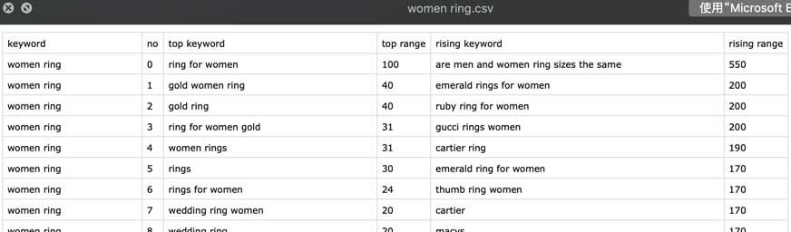
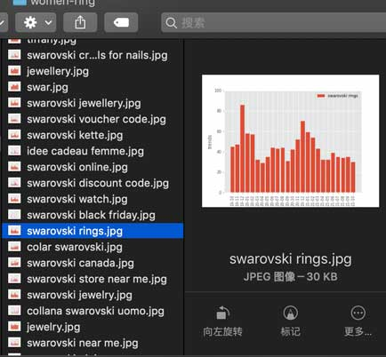

# 通过google trends查找相关关键词，并且生成趋势

## 效果

例子：通过`women ring`关键词查找出有1千个相关关键词：[women ring.csv](women-ring/women ring.csv)

以及其生成关键词趋势，如：[swarovski rings.jpg](women-ring/swarovski rings.jpg)

## 实现
1. 使用[pytrends](https://github.com/GeneralMills/pytrends) 开源库。
2. 使用[002-V2rayPool](../002-V2rayPool) 代理（可选择第三方代理）。
3. 实现入口请参照：[main.py](main.py) 

> 注：项目架构是使用[Scrapy](https://www.osgeo.cn/scrapy/intro/overview.html) 实现的，可实现amazon关键词查询等。 