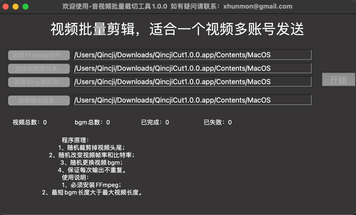

# FFmpeg批量剪切音视频

[V2版本脚本](ff_util_v2.py)更加完善，但是未接入GUI

本项目主要通过ffmpeg工具进行批量视频剪辑，随机剪辑，从而躲过自媒体平台的检查，从而达到一份视频多个账号运营。

使用前提：**必须要安装ffmpeg程序**，安装过程请自行百度。


下载地址：

MacOS：[QincjiCut1.0.0-mac](https://github.com/xhunmon/PythonIsTools/releases/download/1.0.4/QincjiCut1.0.0.app.zip)  下载后解压后使用

Window：QincjiCut1.0.0-win （未打包）

效果如图：



#主要知识点

## python GUI(界面)

本文使用tkinter GUI(界面)框架进行界面显示：[./ui.py](ui.py) ，[学习参考](https://www.cnblogs.com/shwee/p/9427975.html) 。

## [pyinstaller](https://pyinstaller.readthedocs.io/en/stable/) 打包

使用pyinstaller把python程序打包成window和mac可执行文件，主要命令如下：
```shell
#① ：生成xxx.spec文件；（去掉命令窗口-w）
pyinstaller -F -i res/logo.ico main.py  -w
#②：修改xxx.spec，参考main.spec
#③：再次进行打包，参考installer-mac.sh
pyinstaller -F -i res/logo.ico main.spec  -w
```
打包脚本与配置已放在 `doc` 目录下，需要拷贝出根目录进行打包。

注意：
pyinstaller打包工具的版本与python版本、python所需第三方库以及操作系统会存在各种问题，所以需要看日志查找问题。例如：打包后运用，发现导入pyppeteer报错，通过降低版本后能正常使用：pip install pyppeteer==0.2.2

## 项目
本项目跟Downloader下载器基本相同，而ffmpeg命令则可以通过 [](https://qincji.gitee.io/2021/01/18/ffmpeg/18_command/)

