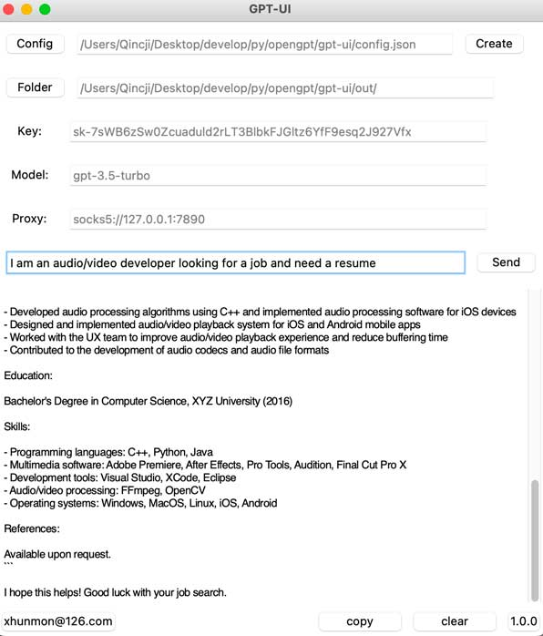

Build your ChatGPT app.




# Run
- 1.clone this repo
- 2.edit your config.json
```json
{
  "key": "your api key",                            //create at https://platform.openai.com/account/api-keys
  "api_base": "",
  "model": "gpt-3.5-turbo",                         //support: gpt-3.5-turbo/gpt-4/gpt-4-32k
  "stream": true,
  "response": true,                           
  "folder": "/Users/Qincji/Desktop/gptfileout/",    //directory where chat logs are saved
  "repeat": true,                                   //if false: all chats in one file.  if true: each chat is in a new file
  "proxy": "socks5://127.0.0.1:7890"                //support proxy: HTTP/HTTPS/SOCKS4A/SOCKS5
}

```
- 3.run main.py


# Build App
- 4.install pyinstaller
- 5.cd `GPT-UI`
- 6.run `pyinstaller --windowed --name GPT-UI --add-data "config.ini:."  --icon logo.ico main.py gpt.py utils.py`


# Feature
- [x] Support model: gpt-3.5-turbo/gpt-4/gpt-4-32k
- [x] Support for exporting chat logs to files
- [x] Support proxy: HTTP/HTTPS/SOCKS4A/SOCKS5
- [x] Build MacOS App
- [x] Build Window exe
- [ ] Support for generating images

# Link
- API key generated: [https://platform.openai.com/account/api-keys](https://platform.openai.com/account/api-keys)
- [https://github.com/evilpan/gptcli](https://github.com/evilpan/gptcli)
